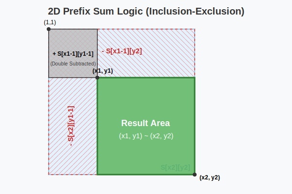

# [11660] 구간 합 구하기 5
링크 : https://www.acmicpc.net/problem/11660

## 1. 문제 분석
**접근 방식:** 누적 합 배열을 배우고, 3x3 행렬을 그려봐서 개념 확실히 익히기

**시간 복잡도:** $O(N^2)$



## 2. Python 풀이
```python
import sys
input = sys.stdin.readline

n,m = map(int, input().split())
matrix = [list(map(int, input().split())) for _ in range(n)]

# 누적 합 배열
prefix_sum = [[0] * (n + 1) for _ in range(n + 1)]


for i in range(1,n+1):
    for j in range(1,n+1):
        prefix_sum[i][j] = prefix_sum[i-1][j] + prefix_sum[i][j-1] - prefix_sum[i-1][j-1] + matrix[i-1][j-1]


for _ in range(m):
    x1, y1, x2, y2 = map(int, input().split())
    result = prefix_sum[x2][y2] - prefix_sum[x1-1][y2] - prefix_sum[x2][y1-1] + prefix_sum[x1-1][y1-1]
    print(result)
```

## 3. 학습 내용
**새로 알게 된 점:** 누적 합의 원리

## 추가 학습
**다른 사람의 풀이 (itertools 활용 최적화)**
기존의 $O(N^2)$ 2중 반복문 방식은 Python 인터프리터 오버헤드로 인해 속도가 느림. 

이를 C로 최적화된 Python 내장 모듈(`itertools`)을 활용하여 획기적으로 개선한 풀이
* **성능 비교:** 시간 약 1000ms+ $\rightarrow$ **556ms** (약 2배 향상)

### 1. 사용된 핵심 개념
* **`itertools.accumulate(iterable)`**:
  - 입력된 리스트의 순차적인 누적 합을 계산하여 반환합니다.
  - 예: `accumulate([1, 2, 3, 4])` $\rightarrow$ `[1, 3, 6, 10]`

* **`zip(iter1, iter2)`**:
  - 두 개의 리스트에서 동일한 인덱스의 요소끼리 묶어 튜플로 반환합니다.
```python
numbers = [1,2,3]
words = ["HI","There","U"]
for zipping in zip(numbers,words):
    print(zipping)

--- 출력 --- 
(1, 'HI')
(2, 'There')
(3, 'U')
```

### 2. 최적화 코드
```python
import sys
from itertools import accumulate
input = sys.stdin.readline

dim, num = map(int, input().split())

# (dim+1) x (dim+1) 크기의 배열 초기화 (0번 행 패딩)
data = [[0] * (dim + 1)]

for _ in range(dim):
    # 1. accumulate로 현재 입력받은 줄의 '가로 누적 합'을 계산
    # map(int, input().split())으로 입력을 정수로 변환 후 즉시 누적 합 적용
    row_acc = accumulate(map(int, input().split()))
    
    # 2. zip을 사용해 (바로 윗 줄의 누적 합) + (현재 줄의 가로 누적 합) 수행
    # data[-1][1:] : 바로 윗 행(data[-1])에서 0번 패딩을 제외한 실제 값들
    to_add = [upper + current for upper, current in zip(data[-1][1:], row_acc)]
    
    # 3. 계산된 행 앞에 0(패딩)을 붙여서 data 배열에 추가
    data.append([0] + to_add)

for _ in range(num):
    x1, y1, x2, y2 = map(int, input().split())
    # 2차원 구간 합 구하기 (공식은 동일)
    print(data[x2][y2] + data[x1-1][y1-1] - data[x2][y1-1] - data[x1-1][y2])
```

## 4. 관련 개념
https://docs.python.org/3/library/itertools.html
