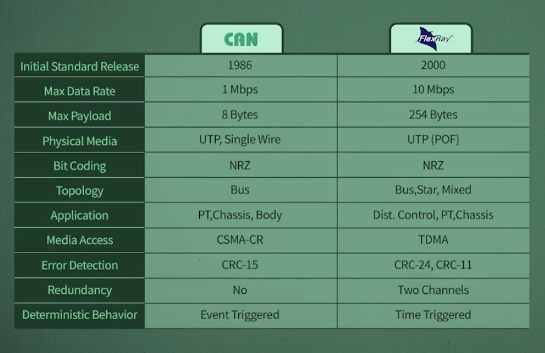
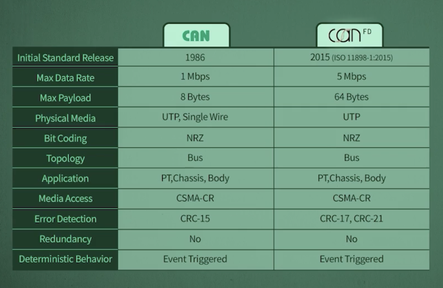
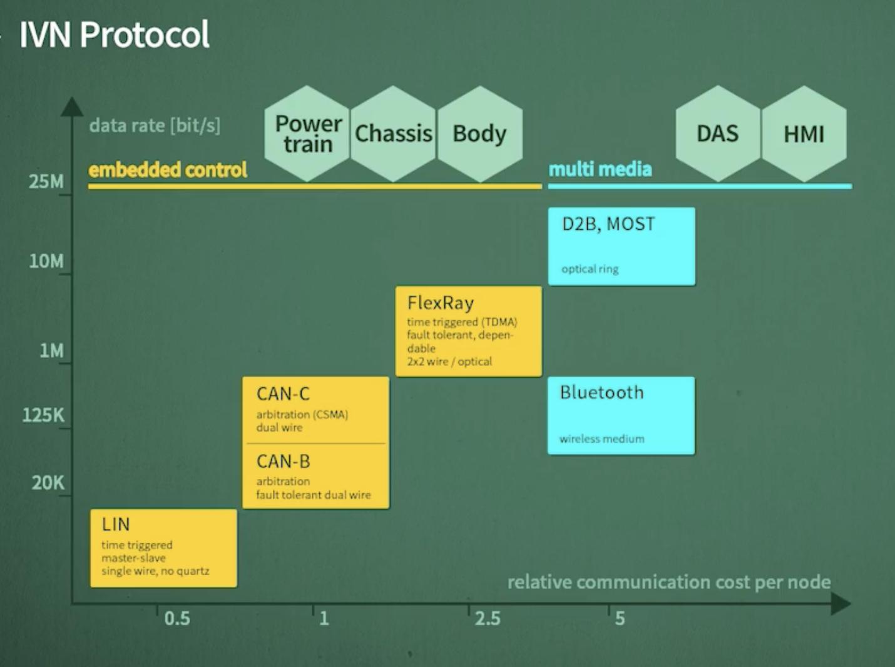

# CAN
30년 넘게 사용
차량의 특성을 잘 반영, 안정성, 신뢰성이 제일 중요하다보니..

1Mbps -> 1초당 100만 bit를 보낼 수 있음

현재 관점에서 보면 광장히 느리지만, 그 당시에는 필요이상으로 빨랐음

실제 적용은 500kbps를 함 -> 신뢰성 향상, 스피드 충족

최대 정보의 크기(Maximum Payload)
8byte, 64bit

정보 전송시 구리선 1줄 
Single Wire CAN은 실제로 X -> 구리선 2줄

Shieled Cable -> 노이즈 발생 감소, 노이즈 영향 감소 [가격이 비쌈]
그래서, 아래를 사용함
Unshieled Cable -> 노이즈 발생시 에러 발생 가능성 높음 [가격이 월등히 쌈]

두 개의 케이블 나란히 쓰지 않고, 꼬아서 사용함 -> UTP(Unshieled Twist Pair) [대부분의 차량 네트워크 선]

비트코딩 -> NRZ(Non Return to Zero) 사용함

Toplogy -> Bus Topology (구리선에 어떤 방식으로 ECU를 연결할 것인가?)

CAN 적용 영역 -> PT,Chassis,Body

Media Access(구리선을 차지하는 방식) -> CSMA, CR
CS : Carrier Sense -> 구리선에 전송되는 정보 유출 감지
MA : Mutiple Access -> 2개 이상의 ECU가 동시에 전송 가능
CR : Collision Resolution -> 충돌이 발생했을 때, 누가 우선권을 가지는가?

CRC -> Cyclic Redundancy Check
에러 검출 방식 중 하나[뒤에서 공부 링크]

Deterministic Latency -> 정해진 시간 내에 정보가 도착해야 함
실시간성이 중요한 차량 네트워크에서 매우 중요한 요소 CAN은 없음 그래서 Deterministic Behavior가 없다라고 표현.
부하율이 높지 않을 때는 사용하는데 큰 문제가 없음

## FlexRay(CAN의 단점보완)
10Mbps -> 1초당 1000만 bit 전송 가능

최대 정보의 크기(Maximum Payload)
254byte, 2032bit

등장이유? ECU가 많아지고, 데이터 전송량이 많아짐 -> CAN의 한계 극복

UTP(Unshieled Twist Pair) 사용

비트코딩 -> NRZ(Non Return to Zero) 사용함
전압 형태는 다르다.

Toplogy -> Bus Topology (구리선에 어떤 방식으로 ECU를 연결할 것인가?)
Star, Mixed Topology 지원

Apllication -> Dist.Control,PT,Chassis(Hard Real Time에 적용하기 위해서 개발된 기술)

Media Access(구리선을 차지하는 방식) -> TDMA, FTDMA
TDMA -> Time Division Multiple Access
FTDMA -> Flexible Time Division Multiple Access
[그림] 시간을 정해서 각 ECU가 정보를 보내는 => 충돌이 발생하지 않음

Error Detection -> CRC 2개 사용

2 Channel 지원 에러 발생 유무를 부가적으로 체크

Time Triggerd 방식 -> Deterministic Behavior 100%
    

### Lin(Local Interconnect Network)
2002년 나옴
20kbps -> 1초당 2000 bit 전송 가능

Actuator - ECU - Sensor 간의 통신에 주로 사용됨 -> 빠른 스피드 필요 없음

CAN을 사용하기엔 아까운 분야에 사용하자!

최대 정보의 크기(Maximum Payload)
8byte

Single Wire 사용 (가격 절감)

BitCoding : NRZ(Non Return to Zero) 사용함

Toplogy -> Bus Topology

Application -> Sensor, Actuator 통신

Master-Slave 방식 

Error Detection -> Checksum 사용

정해진 시간에 정보 전송 -> Deterministic Behavior 지원 1h=60분이 아닌 65,70분 들쭉날쭉함

## CAN-FD(Flexible Data Rate)

2018 기준
MCU칩 : 최대스피드 = 5Mbps ~

최대 정보의 크기(Maximum Payload)
64byte, 512bit

UTP(Unshieled Twist Pair) 사용

비트코딩 -> NRZ(Non Return to Zero) 사용함(CAN과 동일)

Toplogy -> Bus Topology

Apllication 동일(CAN과 동일)

Media Access -> CSMA, CR(CAN과 동일)

CRC -> Cyclic Redundancy Check 다만, 17,21bit 사용
데이터 길이가 16byte 이하면 17bit, 16byte 초과시 21bit 사용

Redundancy 없음
Deterministic Behavior 없음

## OPEN(One Pair EtherNet)
One pair -> 구리선 2줄(1쌍)[배선의 가격과 밀접한 관련]
구리선 두 줄 사용시 차량의 잡음 요건을 만족 시키는 기술

2011년에 재정

100Mbps -> 1초당 1억 bit 전송 가능
1Gbps 기술도 개발

최대 정보의 크기(Maximum Payload)
1,500byte

UTP(Unshieled Twist Pair) 사용

Bit Coding -> 4B/3B...

Star Topology 지원

Apllication : Diagonostic, ECU Prog, Backbone(네트워크의 허리 중추 역할)

Media Access : Switched Full Duplex 방식

CRC 방식으로

Deterministic Behavior 없음

PTP사용 하거나 AVB사용해야함 TSN(Time Sensitive Networking) 적용 필요

