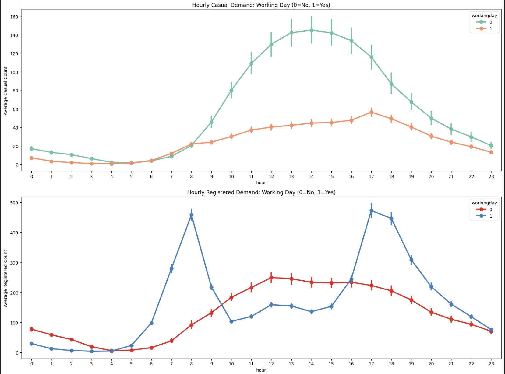

# Bike Prediction Competition[2014]

**Kaggle Link:** https://www.kaggle.com/competitions/bike-sharing-demand

**My Link:** https://www.kaggle.com/code/hunbot/study-bike-demand-ref-top-10-visualization/notebook

## References

[1] Will Cukierski. Bike Sharing Demand. Kaggle, 2014. https://kaggle.com/competitions/bike-sharing-demand

[2] Kaggle Community. Top 10% Bike Sharing RF + GBM. 2024. https://www.kaggle.com/code/snd072/2025aai-top-10-bike-sharing-rf-gbm

## Overview
Top 10%의 성적을 받은 노트북을 참고하여 작성한 자전거 대여 수요 예측 모델을 참고했습니다.

## Project Overview: Bike Sharing Demand Analysis
1. 초기 데이터 진단 결측치 확인 -> 결측치 없음 -> 데이터 특성 파악 (Season, Time 등 외부 환경 요인 확인)
2. 타겟 변수 분석 및 변환 Skewness 확인 (오른쪽으로 치우친 분포 발견) -> $y = \ln(1 + x)$ 수식을 활용한 log1p 변환 수행 -> 정규 분포화 및 RMSLE 지표 최적화 준비
3. 데이터 전처리 datetime 컬럼 분해 (Year, Month, Day, Hour, Dayofweek, WeekofYear) -> 불필요한 변수 제거 및 데이터 타입 최적화 -> 학습용 피처셋 구성
4. 첫 번째 성능 평가 Baseline 모델링 (Random Forest) -> RMSLE 0.43 기록 -> 성능 개선을 위한 K-Means Clustering 시도 -> 시각적 분류에는 성공했으나 모델 성능 개선에는 실패 (실패 원인: 트리 모델의 분기 로직과 정보 중복)
5. TOP 10% Notebook 참고(사용자 유형별 행동 패턴 분리) -> 타겟 변수 분리 (Casual vs Registered) -> 개별 모델 구축 (RF & GBM)
6. 최종 앙상블 및 평가 Weighted Blending (20% Random Forest + 80% Gradient Boosting) -> 예측값 역변환 ($expm1$) -> 최종 RMSLE 0.31 달성 및 잔차 분석(Residual Analysis)을 통한 모델 검증

## Important Approaches and Techniques

### 특수한 날짜 및 공휴일
feature_engineering_check 함수 내부에 있는 피처 엔지니어링 코드가 중요합니다.
데이터셋에 포함된 표준 공휴일 외에, 대여량에 큰 영향을 주었을 실제 사건들을 수동으로 지정했습니다.
1. Sandy Storm: 2012-10-30
2. Christmas/Year-end: 12-24, 12-26, 12-31
### Peak Hours
자전거 대여는 특정 시간대에 집중되는 경향이 있습니다.
- 평일: 출퇴근 시간대 (8시, 12-13시, 17-18시)
- 주말: 낮 시간대 (10-19시)

이를 peak라는 하나의 (0,1) 이진 피처로 통합하여 모델에 반영했습니다.
### Ideal Weather and Sticky Conditions
'자전거 타기 좋은 날씨네~' 라는 직관을 반영한 피처입니다.

```python
    # Extract temporal features
    df['year'] = dt.year
    df['month'] = dt.month
    df['day'] = dt.day
    df['hour'] = dt.hour
    df['dow'] = dt.dayofweek
    df['woy'] = dt.isocalendar().week.astype(int)
    
    # Matching specific date corrections from the notebook
    # Sandy Storm: 2012-10-30
    # Christmas/Year-end: 12-24, 12-26, 12-31
    df['holiday'] = df.apply(lambda x: 1 if (x['year'] == 2012 and x['month'] == 10 and x['day'] == 30) 
                             else (1 if (x['month'] == 12 and x['day'] in [24, 26, 31]) else x['holiday']), axis=1)
    
    df['workingday'] = df.apply(lambda x: 0 if (x['month'] == 12 and x['day'] in [24, 31]) 
                                else x['workingday'], axis=1)

    # Matching peak hours: 8, 12-13, 17-18 for working days; 10-19 for weekends
    df['peak'] = df.apply(lambda x: 1 if ((x['workingday'] == 1 and (x['hour'] == 8 or 17 <= x['hour'] <= 18 or 12 <= x['hour'] <= 13)) or 
                                          (x['workingday'] == 0 and 10 <= x['hour'] <= 19)) else 0, axis=1)
    
    # Ideal weather and Sticky conditions
    df['ideal'] = df.apply(lambda x: 1 if (x['temp'] > 27 and x['windspeed'] < 30) else 0, axis=1)
    df['sticky'] = df.apply(lambda x: 1 if (x['workingday'] == 1 and x['humidity'] >= 60) else 0, axis=1)
```
### Casual vs Registered
사용자 유형에 따른 행동 패턴 차이를 반영하기 위해 타겟 변수를 두 개로 분리했습니다.
- Casual: 비회원 사용자
- Registered: 회원 사용자

그래프를 보면 두 그룹의 대여 패턴이 확연히 다름을 알 수 있습니다.

평소에 저희가 쏘카나 킥고잉 같은 공유 모빌리티를 이용할 때를 생각해보면 나올 수 있는 인사이트입니다.



### Custom Train-Test Split
```python
def custom_train_test_split(data, cutoff_day=15):
    # Split data based on the day of the month
    # Days 1-15 for training, after 15 for validation
    train = data[data['day'] <= cutoff_day]
    test = data[data['day'] > cutoff_day]
    return train, test
```
실제 테스트셋이 매월 20일 이후 데이터인 점을 고려.

### Feature & Target Variables
```python
def prep_data(data, input_cols):
    # Select features and separate target log values
    X = data[input_cols]
    y_r = data['registered_log']
    y_c = data['casual_log']
    return X, y_r, y_c
```

## Ensemble
Random Forest와 Gradient Boosting 모델의 예측값을 가중합하여 최종 예측값을 도출.

정형 데이터에서는 주로 Tree 기반 모델이 더 우수한 성능을 보이는데, 이는 아래 논문 리뷰 링크에서도 확인할 수 있습니다. 

[Why do tree-based models still outperform deep learning on tabular data?](#why-do-tree-based-models-still-outperform-deep-learning-on-tabular-data)

### Tree-Based Models Summary

| 분류 | 알고리즘 | 핵심 메커니즘 | 주요 특징 |
|---|---|---|---|
| Bagging | Random Forest | 부트스트랩 샘플링 + 피처 무작위 선택 | 병렬 학습, 과적합 방지, 매우 안정적임 |
| Bagging | Extra Trees | 무작위 분할점 선택 (Random Split) | RF보다 빠르고 편향은 높으나 분산은 더 낮음 |
| Boosting | AdaBoost | 오답에 가중치 부여 (Sequential) | 단순한 모델(Stump) 결합에 유리, 이상치에 민감 |
| Boosting | GBDT / GBM | 잔차(Residual)를 단계별로 학습 | 정교한 예측, 병렬화 어려움, 학습 속도 느림 |
| Boosting | XGBoost | GBDT + 규제(Regularization) + 시스템 최적화 | 결측치 처리, 병렬 CPU 학습 지원, 과적합 방지 우수 |
| Boosting | LightGBM | Leaf-wise 성장 + GOSS + EFB | 매우 빠름, 대용량 데이터 최적화, 메모리 적게 사용 |
| Boosting | CatBoost | Ordered Boosting + 범주형 변수 자동 처리 | 범주형 데이터 압축적 처리, 하이퍼파라미터 의존도 낮음 |
| 특수 목적 | Isolation Forest | 고립(Isolation)을 통한 이상치 탐지 | 이상치 탐지용, 데이터 전처리 불필요 |
| 특수 목적 | RT Embedding | 비지도 학습 기반 피처 차원 확장 | 고차원 특징 생성용, 주로 선형 모델의 전처리로 사용 |
| 메타 학습 | Stacking / Voting | 여러 모델의 예측값을 결합 | 모델 간 상호보완, 최고 수준의 정확도 목표 |

여러 모델중에 Random Forest와 Gradient Boosting이 자주 사용되는 이유는 다음과 같습니다:
- Random Forest: 안정적이고 과적합에 강하며, 다양한 데이터셋에서 좋은 성능을 보이고, 여러 트리에 평균을 내어 분산을 줄입니다.
- Gradient Boosting: 복잡한 패턴 학습에 뛰어나며, 하이퍼파라미터 튜닝을 통해 성능 극대화 가능하며, Residual을 줄여나가며 편향을 제거하는 데 효과적입니다.

> 20:80 비율은 RF&GBM의 반복된 학습을 통해서 최적의 성능을 내는 조합으로 찾은 값으로 보입니다. 두 개를 섞는 이유도 마찬가지로 원작자의 경험이나 직관에서 바탕한 것으로 보입니다.
>
> Gradient Boosting(GBM)은 이전 단계의 오차를 지속적으로 보정하며 학습하기 때문에 예측의 정교함 측면에서 매우 강력한 성능을 보여줍니다. 따라서 전체적인 예측의 중심을 잡는 메인 모델로서 80%라는 높은 가중치를 부여받은 것으로 생각됩니다.
>
> Random Forest(RF)는 여러 트리의 평균을 통해 모델의 안정성을 확보하고 과적합(Overfitting)을 방지하는 방패 역할을 합니다. 20%라는 비중을 섞어줌으로써 GBM이 특정 데이터 노이즈에 과도하게 반응하여 발생할 수 있는 오차를 줄이고, 모델의 일반화 성능을 높이는 효과를 노린 것으로 보입니다.

## Study Notes
> Link
- What is Random Forest? :
- Why we are Using Log1p Transformation? :
- RMSLE Metric Explanation :
- K-Means Clustering :
- Gradient Boosting :

#### Why do tree-based models still outperform deep learning on tabular data?
Review Link : 
https://arxiv.org/pdf/2207.08815
